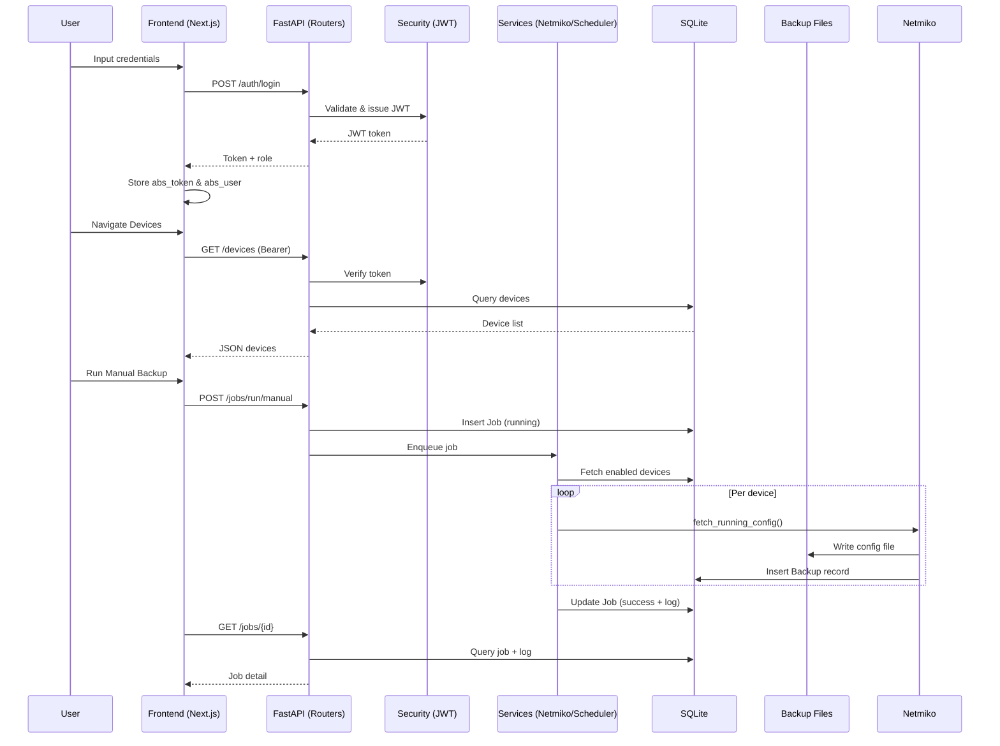

# ABS (Automated Backup System) – Dokumentasi Lengkap

Dokumen ini merangkum keseluruhan arsitektur, fitur, API, serta proses operasional aplikasi ABS.

---
## 1. Tujuan Aplikasi
### 1.1 Fungsi Utama
ABS adalah sistem terpusat untuk:
- Inventaris perangkat jaringan multi-vendor (Cisco, Juniper, MikroTik, Fortinet, Huawei, Aruba, dll).
- Eksekusi backup konfigurasi (manual & terjadwal) via SSH atau Telnet.
- Penyimpanan aman kredensial (terenkripsi) & audit trail aksi penting.
- Manajemen pengguna berbasis peran (admin & viewer).
- Monitoring job & file backup.

### 1.2 Fitur Inti
- Autentikasi JWT (login, me).
- Role-based access (admin penuh, viewer read-only).
- CRUD perangkat + test koneksi.
- Backup manual (via endpoint /jobs/run/manual).
- Backup terjadwal (APScheduler) dengan filter target (All, Tag, Device).
- Penyimpanan file konfigurasi (.cfg) + metadata (hash, size, path).
- Audit log (aksi: login, create/update/delete device/user, job run, download backup).
- Retensi (field disiapkan, belum diimplementasikan pembersihan otomatis).
- Health check `/health`.

### 1.3 Alur Kerja Pengguna
Admin:
1. Login → token & role disimpan di `localStorage`.
2. Tambah perangkat → test koneksi → aktif/nonaktifkan perangkat.
3. Jalankan backup manual atau buat jadwal backup.
4. Pantau status job & hasil backup.
5. Kelola pengguna lain & audit log.

Viewer:
- Login → lihat daftar perangkat, jobs, backups, audit log (tanpa modifikasi).

---
## 2. Arsitektur Project
### 2.1 Backend Tech Stack
- FastAPI (routing & dependency injection).
- SQLAlchemy 2.x (ORM) + SQLite (default file `abs.db`).
- APScheduler (AsyncIOScheduler) untuk jadwal backup.
- Netmiko + Telnet manual (mengambil konfigurasi perangkat).
- Passlib (argon2 + pbkdf2_sha256) untuk hashing password.
- JWT (PyJWT) untuk akses token.

### 2.2 Frontend Tech Stack
- Next.js (App Router) + React.
- TypeScript.
- Tailwind CSS + komponen UI kustom.
- Fetch wrapper `api.ts` (GET/POST/PUT/DELETE + error handling).
- LocalStorage untuk token `abs_token` & data user `abs_user`.

### 2.3 Komunikasi Frontend ↔ Backend
- REST API (JSON) melalui path `/api/...` (diasumsikan reverse proxy oleh Nginx).
- Header `Authorization: Bearer <JWT>` ditambahkan secara dinamis.
- CORS diatur via `settings.CORS_ORIGINS`.

### 2.4 Diagram Arsitektur (Mermaid)
```mermaid
%% File: docs/architecture.mmd
graph TD
    subgraph Client[Frontend - Next.js (Browser)]
        UI[Pages / Views]
        APIWrap[Fetch Wrapper (api.ts)]
        LocalStorage[(localStorage: abs_token, abs_user)]
        UI --> APIWrap
        UI --> LocalStorage
    end

    subgraph Backend[Backend - FastAPI Application]
        Main[main.py (FastAPI App)]
        subgraph Routers[Routers / API Layer]
            Auth[/auth/*]
            Users[/users/*]
            Devices[/devices/*]
            Jobs[/jobs/*]
            Backups[/backups/*]
            Schedules[/schedules/*]
            Audit[/audit-logs/*]
            Health[/health]
        end
        subgraph Services[Business Services]
            Scheduler[APScheduler (scheduler.py)]
            Netmiko[Netmiko Worker (netmiko_worker.py)]
            JobQ[Job Queue (job_controller.py)]
            AuditSvc[Audit Logger (audit_log.py)]
            Retention[Retention (retention.py)]
            Crypto[Crypto (crypto.py)]
        end
        Security[security.py]
        Schemas[schemas.py]
        Models[models.py]
        Settings[settings.py]
        Main --> Routers
        Main --> Services
        Main --> Security
        Main --> Settings
        Routers --> Schemas
        Routers --> Services
        Services --> Models
        Security --> Models
    end

    subgraph Storage[Persistence]
        DB[(SQLite Database)]
        BackupFiles[(Backup Files .cfg)]
    end

    APIWrap -->|HTTP /api/... + Bearer| Nginx[Reverse Proxy]
    Nginx --> Main
    Models --> DB
    Netmiko --> BackupFiles

    Scheduler -->|trigger interval| Jobs
    Jobs --> JobQ
    JobQ --> Netmiko
    Netmiko --> BackupFiles
    Services --> AuditSvc
    AuditSvc --> Models
```

### 2.5 Diagram Request Flow (Mermaid)


---
## 3. Struktur Folder
### 3.1 Backend
- `app/main.py` – Inisialisasi FastAPI, registrasi router, startup: membuat default user & memulai scheduler.
- `app/models.py` – Definisi model: User, Device, Job, Backup, Schedule, Audit.
- `app/schemas.py` – Pydantic schemas (request/response). (Isi tidak ditampilkan, diasumsikan sesuai model).
- `app/security.py` – Hash password (argon2/pbkdf2), JWT encode/decode, dependency `get_current_user`, `require_admin`.
- `app/services/`
  - `netmiko_worker.py` – Koneksi SSH/Telnet, ambil running config, simpan file.
  - `scheduler.py` – Load & jalankan jadwal APScheduler, backup terjadwal.
  - `job_controller.py` – Queue async eksekusi job manual.
  - `audit_log.py` – Fungsi `audit_event` mencatat ke tabel Audit.
  - `retention.py` – Util menentukan file yang harus dihapus (belum dipakai).
- `app/api/` – Modul API tematik (devices, jobs, backups).
- `app/routers/` – Router tambahan (users, schedules, audit, auth).
- `app/utils/` – Helper: `crypto.py` (enc/dec), `timeutil.py` (timezone aware now).
- `tests/` – Test autentikasi & proteksi (terbatas).

### 3.2 Frontend
- `src/app/(auth)/login` – Halaman login.
- `src/app/(protected)/...` – Halaman terlindungi (devices, jobs, schedules, users, backups, audit-logs, dashboard).
- `src/views/` – Logika halaman (komponen stateful, misal `devices.tsx`).
- `src/components/` – Komponen UI (reusable: button, table, sidebar, topbar, dll).
- `src/lib/api.ts` – Fetch wrapper (mengatur header & error handling).
- `public/` – Asset statis.
- Config root: `package.json`, `next.config.ts`, `tailwind`, `tsconfig.json`.

---
## 4. Detail Backend
### 4.1 Database & ORM
- SQLite via SQLAlchemy engine (`sqlite:///./abs.db`), non-thread check.
- DeclarativeBase untuk model.

### 4.2 Data Model (Ringkas)
User(id, username, password_hash, role, created_at)
Device(id, hostname, ip, vendor, protocol, port, username_enc, password_enc, secret_enc, tags, enabled)
Job(id, triggered_by, status, started_at, finished_at, devices, log)
Backup(id, device_id(FK), timestamp, size_bytes, hash, status, path)
Schedule(id, name, interval_days, run_at, target_type, target_tags, retention, notify_on_fail, enabled)
Audit(id, timestamp, user, action, target, result)

### 4.3 Router & Endpoint (File Sumber)
Auth (`routers/auth.py`):
- POST `/login`
- GET `/me`

Devices (`api/devices.py`):
- GET `/devices`
- GET `/devices/tags/available`
- POST `/devices`
- PUT `/devices/{id}`
- DELETE `/devices/{id}`
- POST `/devices/{id}/test`

Jobs (`api/jobs.py`):
- POST `/jobs/run/manual`
- GET `/jobs`
- GET `/jobs/{job_id}`
- POST `/jobs/{job_id}/cancel`

Backups (`api/backups.py`):
- GET `/backups`
- GET `/backups/{backup_id}/download`

Schedules (`routers/schedules.py`):
- GET `/schedules`
- POST `/schedules`
- PUT `/schedules/{schedule_id}`
- DELETE `/schedules/{schedule_id}`

Audit Logs (`routers/audit.py`):
- GET `/audit-logs`

Users (`routers/users.py`): (Telah dilihat sebelumnya)
- GET `/users`
- POST `/users`
- PUT `/users/{user_id}`
- DELETE `/users/{user_id}`

Health (`main.py`):
- GET `/health`

### 4.4 Security (`security.py`)
- `hash_password(password)` → argon2 (fallback pbkdf2) menghasilkan hash.
- `verify_password(password, password_hash)` → verifikasi hash.
- `create_access_token(data, expires_delta)` → JWT HS256 dengan klaim `sub`, `exp`.
- `decode_access_token(token)` → validasi + error handling (expired/invalid).
- `get_current_user()` → ambil username dari token, query DB, validasi user.
- `require_admin()` → pastikan peran admin.
Catatan: `oauth2_scheme` memakai `tokenUrl="/auth/token"` → tidak ada endpoint `/auth/token` (potensi mismatch di docs otomatis).

### 4.5 Default Data
Startup event (`main.py`):
- `users_router._ensure_default_users()` → membuat admin & viewer jika kosong.
- `schedules_router._ensure_default_schedule()` → `pass` (tidak buat apapun).
- `audit_router._ensure_example_audit()` → `pass`.

### 4.6 `main.py` Registrasi Router
- Membuat tabel (`Base.metadata.create_all`).
- Menambahkan CORS Middleware.
- `include_router` untuk semua modul.
- `startup` event: seed default + start scheduler.

---
## 5. Detail Frontend
### 5.1 Daftar Halaman
- Login: Form login, simpan token & user.
- Dashboard: Ringkasan (status, statistik job/perangkat – asumsi).
- Devices: CRUD perangkat, test koneksi, toggle enabled.
- Jobs: Jalankan backup manual, lihat progres & log job.
- Backups: Daftar file konfigurasi, download.
- Users: CRUD user (admin only).
- Schedules: CRUD & toggle jadwal.
- Audit Logs: Daftar peristiwa audit (admin only).

### 5.2 Endpoint per Page (Utama)
- Login: POST `/auth/login`, GET `/auth/me`.
- Devices: GET `/devices`, POST/PUT/DELETE `/devices/*`, POST `/devices/{id}/test`.
- Jobs: POST `/jobs/run/manual`, GET `/jobs`, GET `/jobs/{id}`.
- Backups: GET `/backups`, GET `/backups/{id}/download`.
- Schedules: GET/POST/PUT/DELETE `/schedules/*`.
- Users: GET/POST/PUT/DELETE `/users/*`.
- Audit Logs: GET `/audit-logs`.

### 5.3 Manajemen Auth
- Setelah login sukses: `localStorage.setItem('abs_token', <JWT>)` dan `abs_user` (JSON {username, role}).
- Wrapper `api.ts` menambahkan header Authorization jika token ada.
- Protected layout memeriksa token & user sebelum render halaman.

---
## 6. Dokumentasi API (Ringkas)
| Method | URL | Body | Response | Auth |
|--------|-----|------|---------|------|
| GET | /health | - | {status} | - |
| POST | /auth/login | {username,password} | {access_token,username,role} | Public |
| GET | /auth/me | - | {username,role} | Bearer |
| GET | /devices | - | [DeviceOut] | Bearer |
| GET | /devices/tags/available | - | {tags:[string]} | Bearer |
| POST | /devices | DeviceIn | DeviceOut | Admin |
| PUT | /devices/{id} | DeviceIn | DeviceOut | Admin |
| DELETE | /devices/{id} | - | {deleted:true} | Admin |
| POST | /devices/{id}/test | - | {success,message} | Bearer |
| POST | /jobs/run/manual | - | {queued:true} | Admin |
| GET | /jobs | - | [JobSummary] | Bearer |
| GET | /jobs/{job_id} | - | JobDetail | Bearer |
| POST | /jobs/{job_id}/cancel | - | {ok:bool} | Admin |
| GET | /backups | - | [BackupSummary] | Bearer |
| GET | /backups/{id}/download | - | File (text/plain) | Bearer |
| GET | /schedules | - | [ScheduleOut] | Bearer |
| POST | /schedules | ScheduleIn | ScheduleOut | Admin |
| PUT | /schedules/{id} | ScheduleIn | ScheduleOut | Admin |
| DELETE | /schedules/{id} | - | {deleted:true} | Admin |
| GET | /audit-logs | - | [AuditOut] | Admin |
| GET | /users | - | [UserOut] | Bearer |
| POST | /users | UserCreate | UserOut | Admin |
| PUT | /users/{id} | UserUpdate | UserOut | Admin |
| DELETE | /users/{id} | - | {deleted:true} | Admin |

Catatan: Struktur schema detail lihat file `schemas.py`.

---
## 7. Proses Backup Network (Netmiko)
### 7.1 Worker (`netmiko_worker.py`)
- Menentukan command berdasarkan vendor (`_get_config_command`).
- SSH: Netmiko `ConnectHandler` → enable jika secret ada.
- Telnet: Login manual (telnetlib) + disable paging.
- Membaca output + membersihkan prompt + simpan file: `<host>_<hash>.cfg` ke `settings.BACKUP_DIR`.

### 7.2 Manual Job
1. Admin POST `/jobs/run/manual`.
2. Buat record Job (status running).
3. Ambil semua device `enabled=True`.
4. Decrypt kredensial → panggil `fetch_running_config` per device.
5. Simpan Backup record + log per device (delay 3s antar sukses, 2s setelah gagal).
6. Update Job (status success + log + jumlah sukses) → audit event.

### 7.3 Scheduled Job
1. Scheduler start saat startup (`scheduler.start()`).
2. Load semua `Schedule.enabled=True` → buat APScheduler jobs.
3. Saat trigger: `run_scheduled_backup(schedule_id, name)`:
   - Filter device (All vs Tag list) → decrypt kredensial.
   - Jalankan loop backup identik dengan manual.
   - Update Job & audit event `job_run_scheduled`.

### 7.4 Catatan
- Retention belum dipanggil (field `retention` tersedia).
- `notify_on_fail` belum digunakan untuk notifikasi.

---
## 8. Cara Menjalankan Project
### 8.1 Backend (Local)
```powershell
cd backend
python -m venv .venv
.venv\Scripts\activate
pip install -r requirements.txt
uvicorn app.main:app --reload --port 8000
```
Akses: http://localhost:8000/health

### 8.2 Frontend (Local)
```powershell
cd frontend
npm install
npm run dev
```
Akses: http://localhost:3000

### 8.3 Docker Compose
```powershell
cd c:\Users\Jose\Documents\abs-app
docker compose build
docker compose up -d
```
Periksa: `curl http://localhost:2003/health`

### 8.4 Test Endpoint (Contoh)
```powershell
# Login
curl -X POST http://localhost:2003/auth/login -H "Content-Type: application/json" -d '{"username":"admin","password":"admin123"}'
# Gunakan token
$token = "<TOKEN>"
curl -H "Authorization: Bearer $token" http://localhost:2003/devices
```

### 8.5 Jalankan Job Manual
- UI: Tombol "Run Manual Backup" di halaman Jobs.
- API: `POST /jobs/run/manual` dengan header Authorization admin.

---
## 9. Saran Perbaikan
### 9.1 Security
- Ganti `SECRET_KEY` di produksi (gunakan variabel env rahasia).
- Tambah rate limiting (mis. FastAPI-limiter) untuk login & endpoint sensitif.
- Implement logout (opsional blacklisting atau pendekatan short-lived token + refresh).
- Validasi strenght password (min panjang, karakter kompleks).
- Pertimbangkan migrasi SQLite ke PostgreSQL untuk concurrency & scale.

### 9.2 Struktur
- Konsolidasikan router (semua di `api/` atau `routers/` satu pendekatan).
- Perbaiki `tokenUrl` OAuth2 agar konsisten dengan endpoint login atau hapus jika tidak perlu.
- Abstraksi command vendor ke file konfigurasi (YAML/JSON) agar mudah update.

### 9.3 Arsitektur
- Gunakan task queue (Celery/RQ) untuk eksekusi backup lebih scalable.
- Tambah sistem notifikasi (email/Slack) untuk job gagal.
- Implement retention otomatis (hapus backup melebihi `retention`).
- Tambah diff antar backup (mendeteksi perubahan konfigurasi penting).

### 9.4 Future Improvement
- Pagination & filtering di semua listing (devices, backups, audit).
- Metrics/monitoring (Prometheus + Grafana).
- Role granular (misal operator vs auditor).
- Plugin vendor (interface standard).
- Enkripsi file backup (opsional) + integrasi KMS.

### 9.5 Missing / Mismatch
- `tokenUrl="/auth/token"` tidak ada endpoint terkait.
- Retention & notify_on_fail belum dipakai.
- Command Fortinet di `_get_config_command` hanya `show` (mungkin perlu `show full-configuration`).
- Tidak ada pagination (potensi beban besar pada list).

---
## 10. Referensi File
- Backend Entry: `backend/app/main.py`
- Models: `backend/app/models.py`
- Security: `backend/app/security.py`
- Devices API: `backend/app/api/devices.py`
- Jobs API: `backend/app/api/jobs.py`
- Backups API: `backend/app/api/backups.py`
- Schedules Router: `backend/app/routers/schedules.py`
- Audit Router: `backend/app/routers/audit.py`
- Netmiko Worker: `backend/app/services/netmiko_worker.py`
- Scheduler: `backend/app/services/scheduler.py`
- Audit Service: `backend/app/services/audit_log.py`
- Frontend Fetch Wrapper: `frontend/src/lib/api.ts`
- Frontend Devices View: `frontend/src/views/devices.tsx`

---
## 11. Konversi ke PDF (Panduan)
### 11.1 Instalasi Alat (Windows PowerShell)
Pastikan sudah menginstal Node.js & Pandoc.
```powershell
# Install pandoc (jika belum) - atau unduh dari https://pandoc.org
choco install pandoc -y  # jika menggunakan Chocolatey

# Install mermaid-cli untuk render diagram mermaid
npm install -g @mermaid-js/mermaid-cli
```

### 11.2 Render Diagram ke SVG/PNG (Opsional)
```powershell
cd docs
mmdc -i architecture.mmd -o architecture.svg
mmdc -i request-flow.mmd -o request-flow.svg
```
Lalu edit `ABS_DOCUMENTATION.md` untuk menyisipkan gambar:
```markdown


```

### 11.3 Konversi Markdown ke PDF
```powershell
cd docs
pandoc ABS_DOCUMENTATION.md -o ABS_DOCUMENTATION.pdf --from markdown --toc --pdf-engine=xelatex
```
Tambahkan opsi font jika perlu:
```powershell
pandoc ABS_DOCUMENTATION.md -o ABS_DOCUMENTATION.pdf --pdf-engine=xelatex -V mainfont="Arial"
```

### 11.4 Alternatif Tanpa LaTeX
Gunakan wkhtmltopdf:
```powershell
pandoc ABS_DOCUMENTATION.md -o ABS_DOCUMENTATION.pdf --from markdown -t html5 --pdf-engine=wkhtmltopdf
```

### 11.5 Otomatisasi (GitHub Actions Contoh)
Tambahkan workflow:
```yaml
name: build-doc
on: [push]
jobs:
  pdf:
    runs-on: ubuntu-latest
    steps:
      - uses: actions/checkout@v4
      - run: sudo apt-get update && sudo apt-get install -y pandoc
      - run: npm install -g @mermaid-js/mermaid-cli
      - run: mmdc -i docs/architecture.mmd -o docs/architecture.svg
      - run: mmdc -i docs/request-flow.mmd -o docs/request-flow.svg
      - run: pandoc docs/ABS_DOCUMENTATION.md -o docs/ABS_DOCUMENTATION.pdf --from markdown --toc
      - uses: actions/upload-artifact@v4
        with:
          name: abs-docs
          path: docs/*.pdf
```

---
## 12. Ringkasan Akhir
Dokumen ini menyatukan detail aplikasi ABS: tujuan, arsitektur, model data, endpoint, proses backup, cara menjalankan, serta saran perbaikan. Diagram disiapkan dalam format Mermaid untuk fleksibilitas konversi.

Silakan lanjutkan dengan konversi PDF sesuai kebutuhan.
