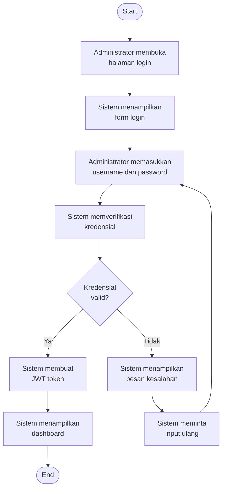
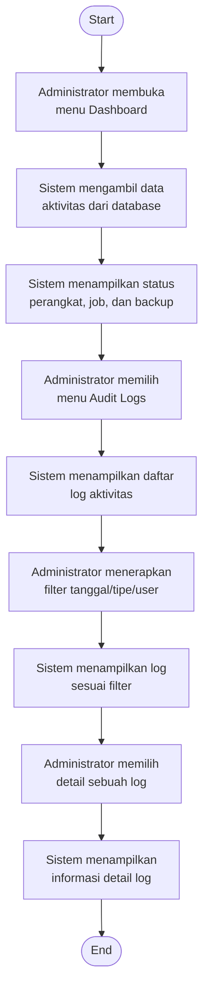
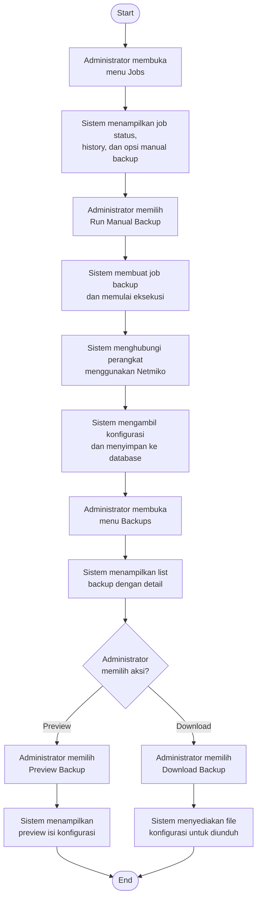
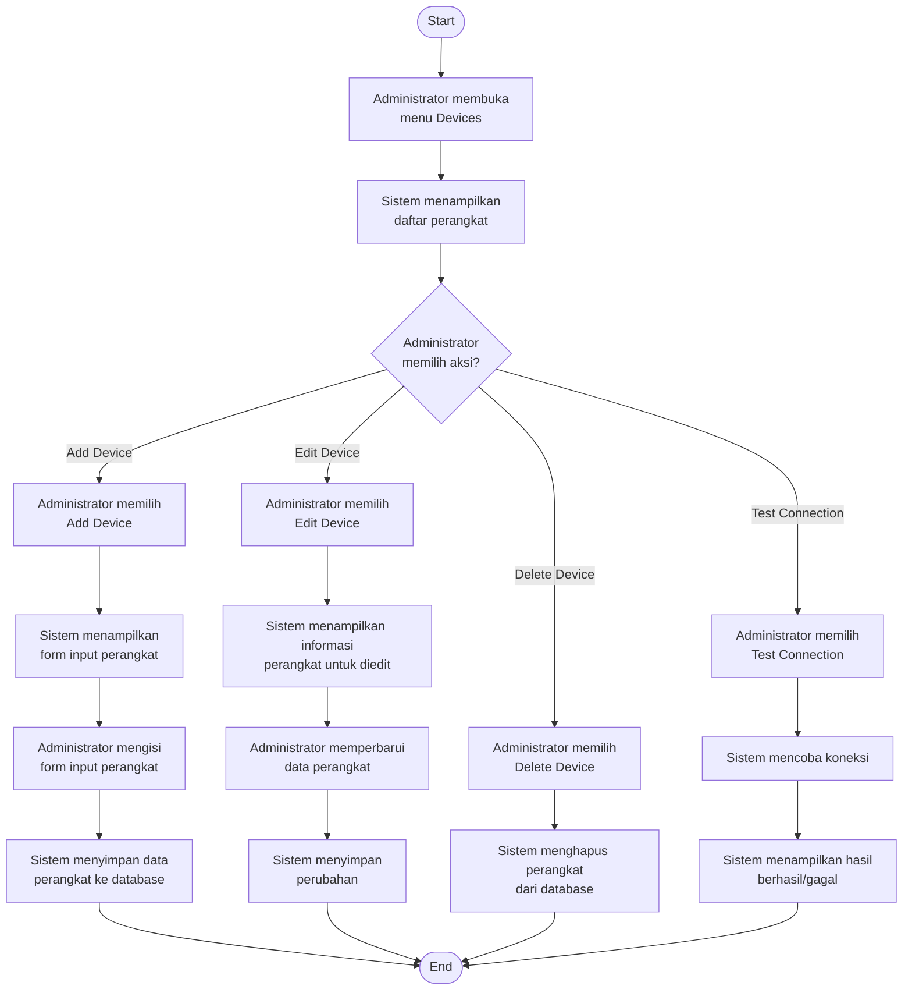
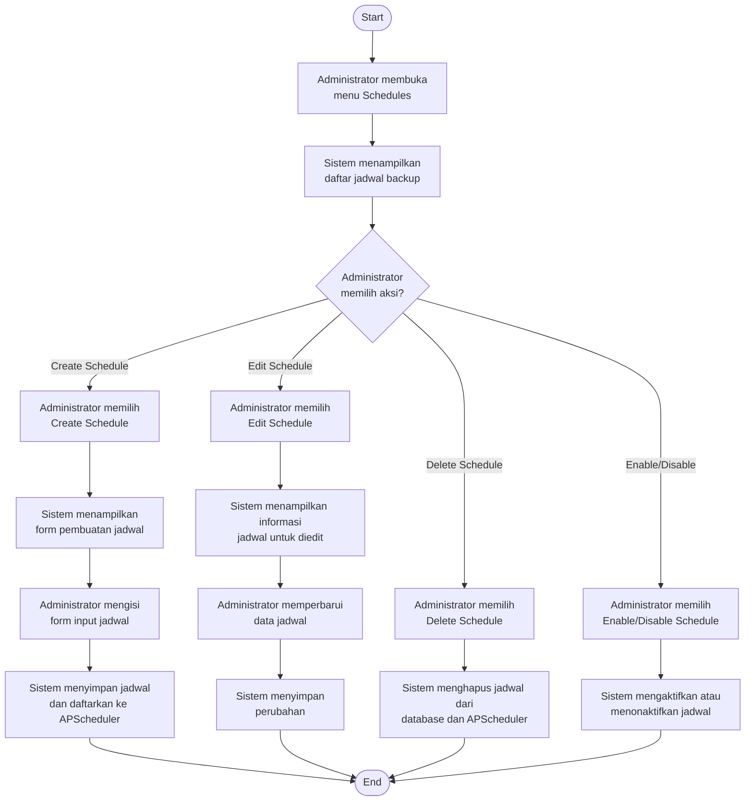
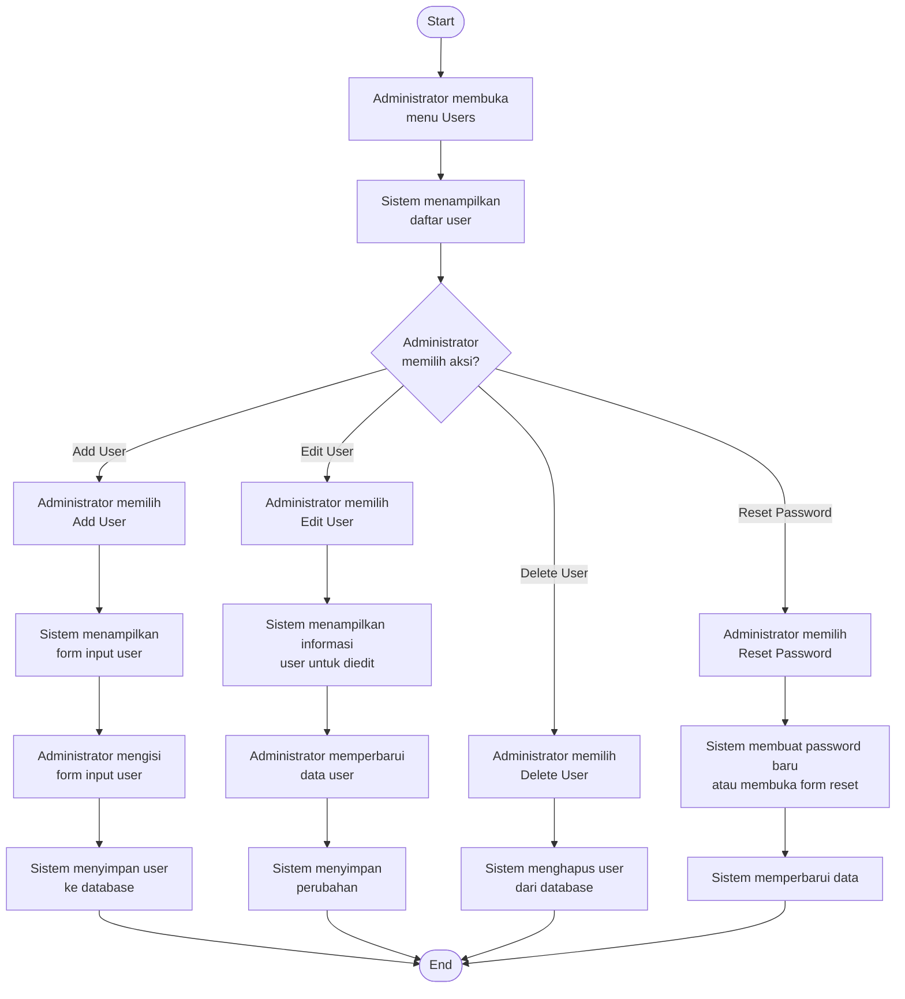

# Activity Diagrams - ABS Use Cases

## Activity Diagram 1: Login to System

---

## Activity Diagram 2: Monitor System Activity

---

## Activity Diagram 3: Perform Backup Operations

---

## Activity Diagram 4: Manage Devices

---

## Activity Diagram 5: Manage Backup Schedules

---

## Activity Diagram 6: Manage Users

---

## Cara Menggunakan Diagram

File ini berisi activity diagram dalam format Mermaid untuk 6 use case utama sistem ABS:

1. **Login to System** - Proses autentikasi pengguna
2. **Monitor System Activity** - Monitoring dashboard dan audit logs
3. **Perform Backup Operations** - Eksekusi dan manajemen backup
4. **Manage Devices** - CRUD operations untuk perangkat jaringan
5. **Manage Backup Schedules** - Manajemen jadwal backup otomatis
6. **Manage Users** - Manajemen user dan roles

### Rendering Diagram

Untuk melihat diagram, Anda dapat:
- Menggunakan VS Code dengan extension Mermaid Preview
- Copy-paste ke Mermaid Live Editor: https://mermaid.live
- Render di dokumentasi Markdown yang support Mermaid (GitHub, GitLab, dll)
